# Row ID Generator System Architecture

This document provides a comprehensive architectural overview of the Row ID Generator system using Mermaid diagrams. The system is designed for high-performance, observable, and scalable row ID generation with Snowflake integration.

> **Repository**: [https://github.com/alakob/row_id_generator](https://github.com/alakob/row_id_generator)  
> **Documentation**: [GitHub Docs](https://github.com/alakob/row_id_generator/blob/main/docs/)  
> **Installation**: `uv pip install git+https://github.com/alakob/row_id_generator.git`

## Complete System Architecture

```mermaid
graph TB
    %% ==============================================
    %% EXTERNAL INTERFACES & USER ENTRY POINTS
    %% ==============================================
    subgraph "External Interfaces"
        CLI[CLI Interface<br/>row-id-generator]
        PythonAPI[Python API<br/>generate_unique_row_ids]
        REST[Future REST API<br/>Extensible]
    end

    %% ==============================================
    %% CORE PROCESSING ENGINE
    %% ==============================================
    subgraph "Core Processing Engine"
        MainFunc[Main Function<br/>generate_unique_row_ids<br/>🎯 Entry Point]
        HashEngine[HashingEngine<br/>🔧 Core Processing]
        Utils[Utils Module<br/>🛠️ Data Preparation]
        
        subgraph "Hashing Operations"
            SingleHash[generate_row_hash<br/>Single Row Processing]
            VectorizedHash[generate_row_ids_vectorized<br/>Batch Processing]
            OptimizedConcat[Optimized Concatenation<br/>Memory Efficient]
        end
    end

    %% ==============================================
    %% DATA VALIDATION & QUALITY
    %% ==============================================
    subgraph "Data Validation & Quality"
        InputValidation[Input Validation<br/>🛡️ DataFrame & Parameters]
        ColumnValidation[Column Validation<br/>🔍 Selection & Quality]
        DataQuality[Data Quality Checks<br/>📊 Uniqueness & Integrity]
        ErrorHandler[Error Handler<br/>⚠️ Comprehensive Recovery]
    end

    %% ==============================================
    %% OBSERVABILITY FRAMEWORK
    %% ==============================================
    subgraph "Observability Framework"
        ObservableEngine[ObservableHashingEngine<br/>🔍 Enhanced Monitoring]
        
        subgraph "Observability Components"
            Logger[StructuredLogger<br/>📝 JSON Logging]
            Metrics[MetricsCollector<br/>📈 Performance Metrics]
            Monitor[PerformanceMonitor<br/>⚡ Resource Tracking]
            Alerts[AlertManager<br/>🚨 Smart Alerting]
            Dashboard[DashboardGenerator<br/>📊 Visualization]
        end
        
        subgraph "Monitoring Data"
            SystemMetrics[System Metrics<br/>CPU, Memory, Disk]
            OperationMetrics[Operation Metrics<br/>Duration, Throughput]
            QualityMetrics[Quality Metrics<br/>Collisions, Errors]
            AlertHistory[Alert History<br/>Events & Notifications]
        end
    end

    %% ==============================================
    %% EXTERNAL INTEGRATIONS
    %% ==============================================
    subgraph "External Integrations"
        SnowflakeInt[Snowflake Integration<br/>❄️ Data Warehouse]
        
        subgraph "Snowflake Components"
            ConnManager[ConnectionManager<br/>🔗 Pool Management]
            DataCompat[Data Compatibility<br/>🔄 Format Conversion]
            HealthCheck[Health Monitoring<br/>💊 Connection Status]
        end
        
        subgraph "External Monitoring"
            Prometheus[Prometheus<br/>📊 Metrics Export]
            Grafana[Grafana<br/>📈 Dashboards]
            EmailAlerts[Email Notifications<br/>📧 SMTP]
            SlackAlerts[Slack Notifications<br/>💬 Webhooks]
        end
    end

    %% ==============================================
    %% CONFIGURATION & SECURITY
    %% ==============================================
    subgraph "Configuration & Security"
        ConfigMgmt[Configuration Management<br/>⚙️ YAML/JSON]
        EnvVars[Environment Variables<br/>🔐 Secrets Management]
        APIKeys[API Keys & Credentials<br/>🗝️ Snowflake Auth]
        Validation[Config Validation<br/>✅ Schema Checks]
    end

    %% ==============================================
    %% DATA FLOW CONNECTIONS
    %% ==============================================
    
    %% External Interfaces to Core
    CLI --> MainFunc
    PythonAPI --> MainFunc
    
    %% Main Function Orchestration
    MainFunc --> InputValidation
    MainFunc --> HashEngine
    MainFunc --> ObservableEngine
    
    %% Validation Flow
    InputValidation --> ColumnValidation
    ColumnValidation --> DataQuality
    DataQuality --> ErrorHandler
    
    %% Core Processing Flow
    HashEngine --> Utils
    HashEngine --> SingleHash
    HashEngine --> VectorizedHash
    VectorizedHash --> OptimizedConcat
    
    %% Observable Engine Integration
    ObservableEngine --> HashEngine
    ObservableEngine --> Logger
    ObservableEngine --> Metrics
    ObservableEngine --> Monitor
    ObservableEngine --> Alerts
    ObservableEngine --> Dashboard
    
    %% Monitoring Data Collection
    Monitor --> SystemMetrics
    HashEngine --> OperationMetrics
    DataQuality --> QualityMetrics
    Alerts --> AlertHistory
    
    %% External Integration Flow
    MainFunc --> SnowflakeInt
    SnowflakeInt --> ConnManager
    SnowflakeInt --> DataCompat
    ConnManager --> HealthCheck
    
    %% External Monitoring Exports
    Metrics --> Prometheus
    Dashboard --> Grafana
    Alerts --> EmailAlerts
    Alerts --> SlackAlerts
    
    %% Configuration Flow
    ConfigMgmt --> EnvVars
    ConfigMgmt --> APIKeys
    ConfigMgmt --> Validation
    APIKeys --> ConnManager
    
    %% Error Handling Flow
    ErrorHandler -.->|Error Recovery| MainFunc
    ErrorHandler -.->|Error Logging| Logger
    ErrorHandler -.->|Error Metrics| Metrics
    ErrorHandler -.->|Critical Alerts| Alerts

    %% ==============================================
    %% STYLING
    %% ==============================================
    classDef external fill:#e1f5fe,stroke:#01579b,stroke-width:2px
    classDef core fill:#e8f5e8,stroke:#2e7d32,stroke-width:2px
    classDef validation fill:#fff3e0,stroke:#f57c00,stroke-width:2px
    classDef observability fill:#f3e5f5,stroke:#7b1fa2,stroke-width:2px
    classDef integration fill:#e0f2f1,stroke:#00695c,stroke-width:2px
    classDef config fill:#fce4ec,stroke:#c2185b,stroke-width:2px
    classDef error fill:#ffebee,stroke:#d32f2f,stroke-width:2px

    class CLI,PythonAPI,REST external
    class MainFunc,HashEngine,Utils,SingleHash,VectorizedHash,OptimizedConcat core
    class InputValidation,ColumnValidation,DataQuality validation
    class ObservableEngine,Logger,Metrics,Monitor,Alerts,Dashboard,SystemMetrics,OperationMetrics,QualityMetrics,AlertHistory observability
    class SnowflakeInt,ConnManager,DataCompat,HealthCheck,Prometheus,Grafana,EmailAlerts,SlackAlerts integration
    class ConfigMgmt,EnvVars,APIKeys,Validation config
    class ErrorHandler error
```

## Data Flow Architecture

```mermaid
flowchart TD
    %% Input Data Sources
    subgraph "Data Sources"
        DataFrame[Pandas DataFrame<br/>📊 Input Data]
        CSVFile[CSV Files<br/>📄 File Input]
        DatabaseQuery[Database Queries<br/>🗃️ SQL Sources]
    end

    %% Processing Pipeline
    subgraph "Processing Pipeline"
        A[Data Ingestion<br/>📥 Load & Validate]
        B[Column Selection<br/>🎯 Auto/Manual]
        C[Data Preprocessing<br/>🔧 Clean & Transform]
        D[Hash Generation<br/>🔐 SHA-256 Processing]
        E[Quality Validation<br/>✅ Collision Detection]
        F[Output Preparation<br/>📤 Format & Package]
    end

    %% Output Destinations
    subgraph "Output Destinations"
        ResultDF[Enhanced DataFrame<br/>📊 With Row IDs]
        SnowflakeDB[Snowflake Database<br/>❄️ Data Warehouse]
        LogFiles[Log Files<br/>📝 Operation Logs]
        Dashboards[Monitoring Dashboards<br/>📊 Real-time Views]
    end

    %% Data Flow
    DataFrame --> A
    CSVFile --> A
    DatabaseQuery --> A
    
    A --> B
    B --> C
    C --> D
    D --> E
    E --> F
    
    F --> ResultDF
    F --> SnowflakeDB
    F --> LogFiles
    F --> Dashboards

    %% Monitoring Data Flow (parallel)
    A -.->|Metrics| LogFiles
    B -.->|Performance| Dashboards
    C -.->|Quality Data| Dashboards
    D -.->|Processing Stats| LogFiles
    E -.->|Quality Metrics| Dashboards

    classDef input fill:#e3f2fd,stroke:#1565c0
    classDef process fill:#e8f5e8,stroke:#2e7d32
    classDef output fill:#fff3e0,stroke:#f57c00
    classDef monitoring fill:#f3e5f5,stroke:#7b1fa2

    class DataFrame,CSVFile,DatabaseQuery input
    class A,B,C,D,E,F process
    class ResultDF,SnowflakeDB,LogFiles,Dashboards output
```

## Security and Authentication Flow

## Error Handling and Recovery Architecture

```mermaid
graph TD
    %% Error Sources
    subgraph "Error Sources"
        InputError[Input Validation Errors<br/>🚫 Bad Data/Parameters]
        ProcessError[Processing Errors<br/>⚠️ Hash Generation Issues]
        SystemError[System Errors<br/>💥 Memory/Resource Issues]
        NetworkError[Network Errors<br/>🌐 Connection Failures]
    end

    %% Error Handling Pipeline
    subgraph "Error Handling Pipeline"
        ErrorCapture[Error Capture<br/>🎯 Exception Catching]
        ErrorClassification[Error Classification<br/>📋 Categorization]
        ContextGathering[Context Gathering<br/>🔍 Debug Information]
        RecoveryStrategy[Recovery Strategy<br/>🔄 Fallback Logic]
    end

    %% Recovery Actions
    subgraph "Recovery Actions"
        AutoRetry[Automatic Retry<br/>🔁 Transient Errors]
        Fallback[Fallback Processing<br/>⚡ Alternative Methods]
        GracefulDegradation[Graceful Degradation<br/>📉 Reduced Functionality]
        UserNotification[User Notification<br/>📢 Error Communication]
    end

    %% Monitoring & Alerting
    subgraph "Monitoring & Alerting"
        ErrorLogging[Error Logging<br/>📝 Structured Logs]
        AlertTrigger[Alert Triggering<br/>🚨 Critical Errors]
        MetricsUpdate[Metrics Update<br/>📊 Error Rates]
        HealthStatus[Health Status<br/>💊 System Health]
    end

    %% Flow Connections
    InputError --> ErrorCapture
    ProcessError --> ErrorCapture
    SystemError --> ErrorCapture
    NetworkError --> ErrorCapture
    
    ErrorCapture --> ErrorClassification
    ErrorClassification --> ContextGathering
    ContextGathering --> RecoveryStrategy
    
    RecoveryStrategy --> AutoRetry
    RecoveryStrategy --> Fallback
    RecoveryStrategy --> GracefulDegradation
    RecoveryStrategy --> UserNotification
    
    ErrorCapture --> ErrorLogging
    ErrorClassification --> AlertTrigger
    RecoveryStrategy --> MetricsUpdate
    MetricsUpdate --> HealthStatus

    classDef errorSource fill:#ffebee,stroke:#d32f2f
    classDef errorHandling fill:#fff3e0,stroke:#f57c00
    classDef recovery fill:#e8f5e8,stroke:#2e7d32
    classDef monitoring fill:#f3e5f5,stroke:#7b1fa2

    class InputError,ProcessError,SystemError,NetworkError errorSource
    class ErrorCapture,ErrorClassification,ContextGathering,RecoveryStrategy errorHandling
    class AutoRetry,Fallback,GracefulDegradation,UserNotification recovery
    class ErrorLogging,AlertTrigger,MetricsUpdate,HealthStatus monitoring
```

## Performance and Scalability Architecture

```mermaid
graph LR
    %% Input Scale
    subgraph "Input Scale"
        SmallData[Small Datasets<br/>< 10K rows]
        MediumData[Medium Datasets<br/>10K - 1M rows]
        LargeData[Large Datasets<br/>1M+ rows]
    end

    %% Processing Strategies
    subgraph "Processing Strategies"
        SimpleProcess[Simple Processing<br/>🔧 Single-threaded]
        BatchProcess[Batch Processing<br/>📦 Chunked Operations]
        ParallelProcess[Parallel Processing<br/>⚡ Multi-threaded]
        StreamProcess[Stream Processing<br/>🌊 Memory Efficient]
    end

    %% Resource Management
    subgraph "Resource Management"
        MemoryMgmt[Memory Management<br/>🧠 Adaptive Chunking]
        CPUOptim[CPU Optimization<br/>⚡ Vectorized Operations]
        CacheStrategy[Caching Strategy<br/>💾 Result Caching]
        LoadBalancer[Load Balancing<br/>⚖️ Resource Distribution]
    end

    %% Performance Monitoring
    subgraph "Performance Monitoring"
        Profiler[Performance Profiler<br/>📊 Execution Analysis]
        ResourceMonitor[Resource Monitor<br/>📈 Real-time Tracking]
        Bottleneck[Bottleneck Detection<br/>🔍 Performance Issues]
        Optimizer[Auto Optimizer<br/>🎯 Dynamic Tuning]
    end

    %% Flow based on data size
    SmallData --> SimpleProcess
    MediumData --> BatchProcess
    LargeData --> ParallelProcess
    LargeData --> StreamProcess

    %% Resource utilization
    SimpleProcess --> MemoryMgmt
    BatchProcess --> CPUOptim
    ParallelProcess --> LoadBalancer
    StreamProcess --> CacheStrategy

    %% Monitoring integration
    MemoryMgmt --> ResourceMonitor
    CPUOptim --> Profiler
    LoadBalancer --> Bottleneck
    CacheStrategy --> Optimizer

    classDef input fill:#e3f2fd,stroke:#1565c0
    classDef strategy fill:#e8f5e8,stroke:#2e7d32
    classDef resource fill:#fff3e0,stroke:#f57c00
    classDef monitoring fill:#f3e5f5,stroke:#7b1fa2

    class SmallData,MediumData,LargeData input
    class SimpleProcess,BatchProcess,ParallelProcess,StreamProcess strategy
    class MemoryMgmt,CPUOptim,CacheStrategy,LoadBalancer resource
    class Profiler,ResourceMonitor,Bottleneck,Optimizer monitoring
```

## Deployment and Infrastructure Architecture

```mermaid
graph TB
    %% Development Environment
    subgraph "Development Environment"
        DevLocal[Local Development<br/>💻 Developer Workstation]
        DevTest[Unit Testing<br/>🧪 Test Suite]
        DevLint[Code Quality<br/>✨ Linting & Formatting]
    end

    %% CI/CD Pipeline
    subgraph "CI/CD Pipeline"
        SourceControl[Source Control<br/>📦 Git Repository]
        BuildSystem[Build System<br/>🏗️ Package Creation]
        TestAutomation[Test Automation<br/>🤖 Automated Testing]
        Deployment[Deployment<br/>🚀 Package Distribution]
    end

    %% Production Environment
    subgraph "Production Environment"
        PackageRegistry[Package Registry<br/>📚 PyPI Distribution]
        UserInstall[User Installation<br/>⬇️ pip/uv install]
        RuntimeEnv[Runtime Environment<br/>🖥️ User Systems]
    end

    %% Monitoring Infrastructure
    subgraph "Monitoring Infrastructure"
        LogAggregation[Log Aggregation<br/>📊 Centralized Logging]
        MetricsStorage[Metrics Storage<br/>💾 Time Series DB]
        AlertingSystem[Alerting System<br/>🚨 Notification Hub]
        Dashboard[Dashboard System<br/>📈 Visualization]
    end

    %% External Services
    subgraph "External Services"
        SnowflakeCloud[Snowflake Cloud<br/>❄️ Data Platform]
        EmailService[Email Service<br/>📧 SMTP Provider]
        SlackWorkspace[Slack Workspace<br/>💬 Team Communication]
        PrometheusServer[Prometheus Server<br/>📊 Metrics Collection]
    end

    %% Development Flow
    DevLocal --> SourceControl
    DevTest --> SourceControl
    DevLint --> SourceControl
    
    %% CI/CD Flow
    SourceControl --> BuildSystem
    BuildSystem --> TestAutomation
    TestAutomation --> Deployment
    Deployment --> PackageRegistry
    
    %% Production Flow
    PackageRegistry --> UserInstall
    UserInstall --> RuntimeEnv
    
    %% Monitoring Flow
    RuntimeEnv --> LogAggregation
    RuntimeEnv --> MetricsStorage
    LogAggregation --> AlertingSystem
    MetricsStorage --> Dashboard
    
    %% External Integration
    RuntimeEnv --> SnowflakeCloud
    AlertingSystem --> EmailService
    AlertingSystem --> SlackWorkspace
    MetricsStorage --> PrometheusServer

    classDef dev fill:#e8f5e8,stroke:#2e7d32
    classDef cicd fill:#e3f2fd,stroke:#1565c0
    classDef prod fill:#fff3e0,stroke:#f57c00
    classDef monitoring fill:#f3e5f5,stroke:#7b1fa2
    classDef external fill:#e0f2f1,stroke:#00695c

    class DevLocal,DevTest,DevLint dev
    class SourceControl,BuildSystem,TestAutomation,Deployment cicd
    class PackageRegistry,UserInstall,RuntimeEnv prod
    class LogAggregation,MetricsStorage,AlertingSystem,Dashboard monitoring
    class SnowflakeCloud,EmailService,SlackWorkspace,PrometheusServer external
```

---

## Architecture Summary

The Row ID Generator system implements a **comprehensive, production-ready architecture** with the following key characteristics:

### 🏗️ **Core Components**
- **Hashing Engine**: High-performance SHA-256 row ID generation with vectorized operations
- **Observable Engine**: Enhanced processing with comprehensive monitoring integration
- **Utils Module**: Data preprocessing, column selection, and quality validation
- **CLI Interface**: Command-line tool for direct usage

### 🛡️ **Security & Authentication**
- **Snowflake Authentication**: Secure connection management with credential isolation
- **Environment Variable Security**: API keys and secrets stored in environment variables
- **Configuration Validation**: Schema-based validation for all configuration parameters
- **Security Monitoring**: Failed authentication attempts and anomaly detection

### 🔍 **Observability Framework**
- **Structured Logging**: JSON-formatted logs with contextual metadata
- **Metrics Collection**: Performance, quality, and system metrics
- **Real-time Monitoring**: Resource usage, operation tracking, and health checks
- **Smart Alerting**: Configurable alerts with multiple notification channels
- **Dashboard Generation**: HTML, JSON, and Grafana-compatible visualizations

### 🌐 **External Integrations**
- **Snowflake Data Warehouse**: Complete integration with connection pooling and health monitoring
- **Prometheus & Grafana**: Metrics export and visualization
- **Email & Slack Notifications**: Multi-channel alerting system
- **Configuration Management**: YAML/JSON configuration with environment overrides

### ⚠️ **Error Handling & Recovery**
- **Comprehensive Error Hierarchy**: Structured exceptions with context preservation
- **Intelligent Recovery**: Automatic retry, fallback strategies, and graceful degradation
- **Data Quality Validation**: Input validation, column selection, and uniqueness checking
- **User-Friendly Error Messages**: Actionable guidance for error resolution

### 🚀 **Performance & Scalability**
- **Adaptive Processing**: Automatic selection of optimal processing strategy based on data size
- **Memory Optimization**: Efficient chunking and streaming for large datasets
- **Parallel Processing**: Multi-threaded operations for improved throughput
- **Resource Monitoring**: Real-time tracking and automatic optimization

### 📦 **Deployment & Distribution**
- **Modern Python Packaging**: pyproject.toml-based configuration with multiple installation methods
- **CI/CD Ready**: Automated testing, building, and distribution pipeline
- **Cross-Platform Support**: Compatible with major operating systems and Python versions
- **Package Registry**: PyPI distribution with uv/pip installation support

This architecture provides a **robust, scalable, and maintainable foundation** for enterprise-grade row ID generation with comprehensive operational visibility and reliability. 